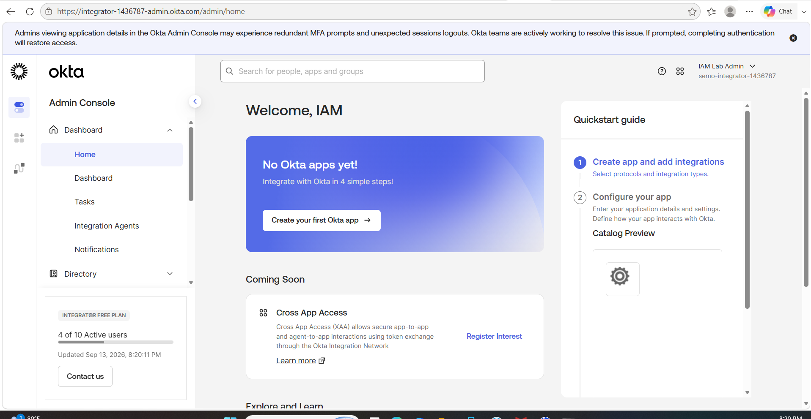
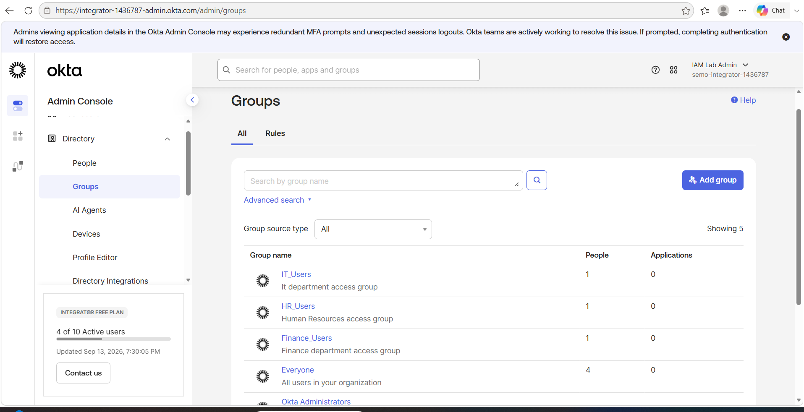
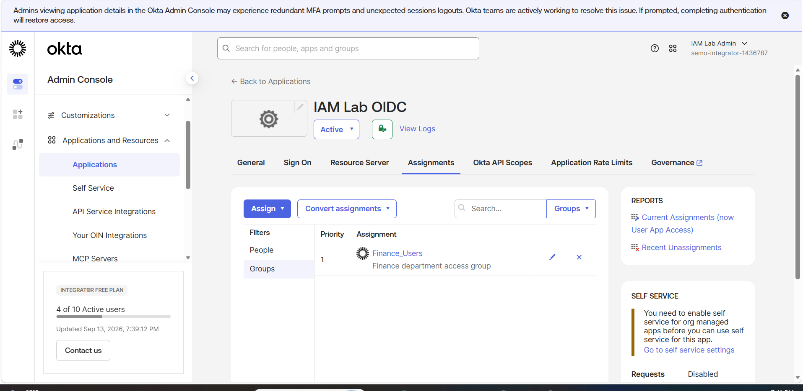
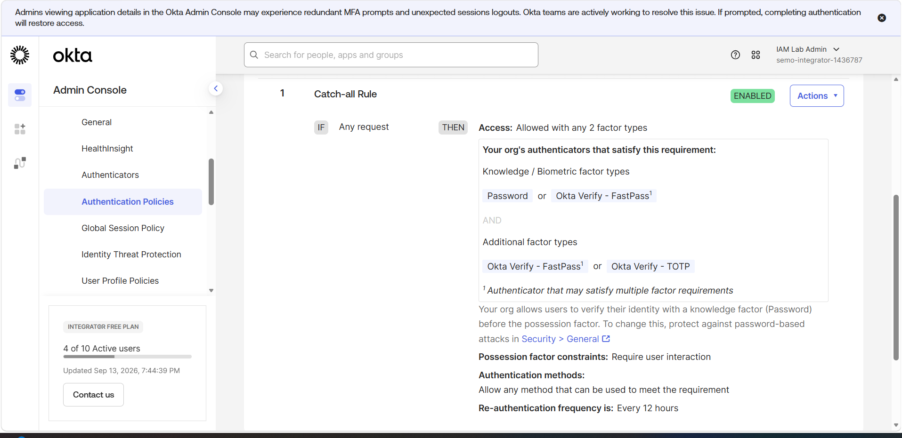
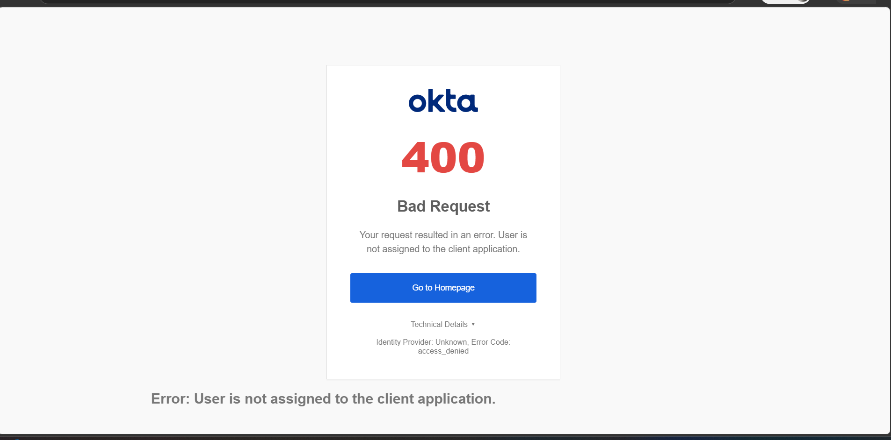

# Okta OIDC SSO, MFA, and Group-Based Access Control Lab

## Project Overview

This hands-on IAM lab demonstrates how to configure an Okta identity environment with department-based groups, an OpenID Connect (OIDC) web application, group-based application access, MFA, and positive/negative access testing.

The goal was to simulate a real IAM scenario in which only authorized users receive access to an application and must satisfy MFA requirements before completing authentication.

## Lab Environment

## Department Groups

Created three department-based groups:

- `Finance_Users`
- `HR_Users`
- `IT_Users`

Each fictional test user was assigned to one department group.

## OIDC Application and Group-Based Assignment

Created an OIDC web application named `IAM Lab OIDC` and assigned only the `Finance_Users` group.

This demonstrates least-privilege application access and group-based authorization.

## MFA Authentication Policy

Configured an authentication policy requiring two factors for application access.

The policy supports a knowledge/biometric factor and an additional factor such as Okta Verify FastPass or TOTP.

## Positive Access Test

A Finance user successfully authenticated through the OIDC flow and reached the configured localhost callback.

## Negative Access Test

A user outside the assigned Finance group attempted to access the OIDC application and was denied because the account was not assigned to the client application.

## Security Concepts Demonstrated

- Identity administration
- Group-based access control
- Least privilege
- OIDC / OAuth 2.0 Authorization Code flow
- Multi-factor authentication
- Application assignment
- Positive and negative access testing
- Authentication policy enforcement
- Access troubleshooting

## Tools Used

- Okta Integrator Free Plan
- Okta Universal Directory
- Okta Verify
- Microsoft Edge InPrivate browsing
- Windows PowerShell
- Local HTTP listener on `localhost:8080`

## Testing Results

| Test | Expected Result | Actual Result | Status |
|---|---|---|---|
| Finance user accesses OIDC app | Allowed after MFA | Callback received | Pass |
| HR user accesses OIDC app | Denied | User not assigned to application | Pass |
| MFA required for assigned user | Two-factor authentication enforced | MFA policy enforced | Pass |

## Resume-Ready Project Description

**Okta OIDC SSO & MFA Access Control Lab**

Configured an Okta identity environment with department-based user groups, an OIDC web application integration, group-based application assignment, and MFA authentication policies. Tested authorized and unauthorized access scenarios to validate least-privilege controls and successfully completed an OIDC authorization flow to a local callback endpoint.
